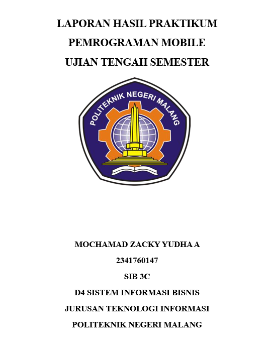
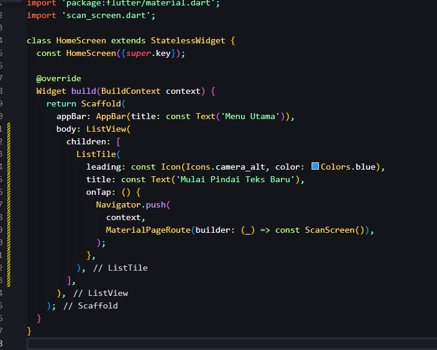
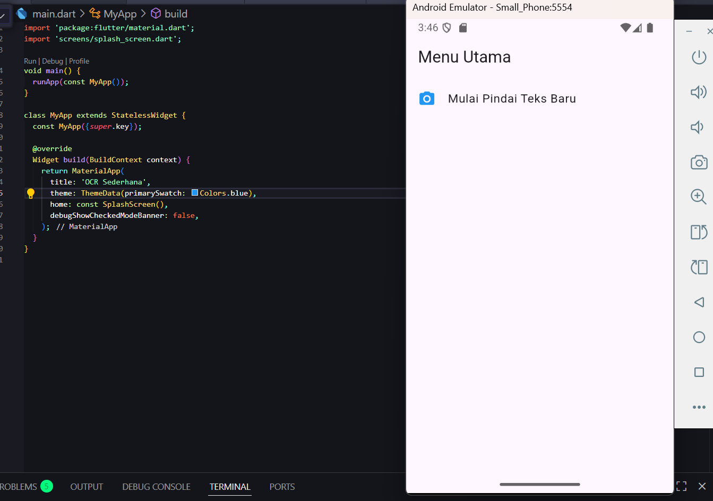
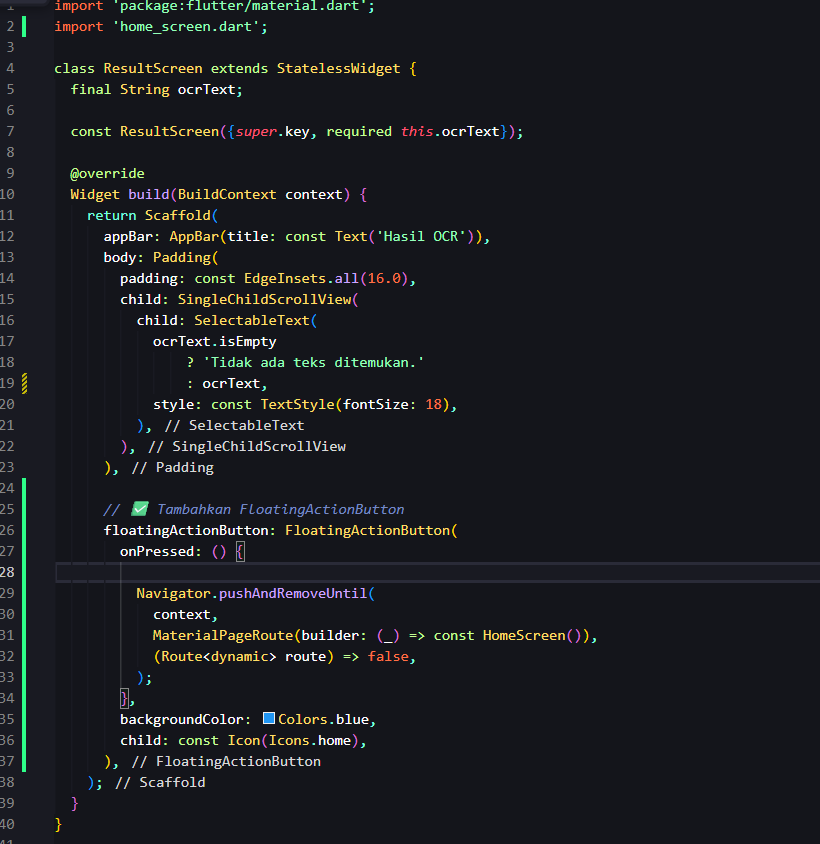
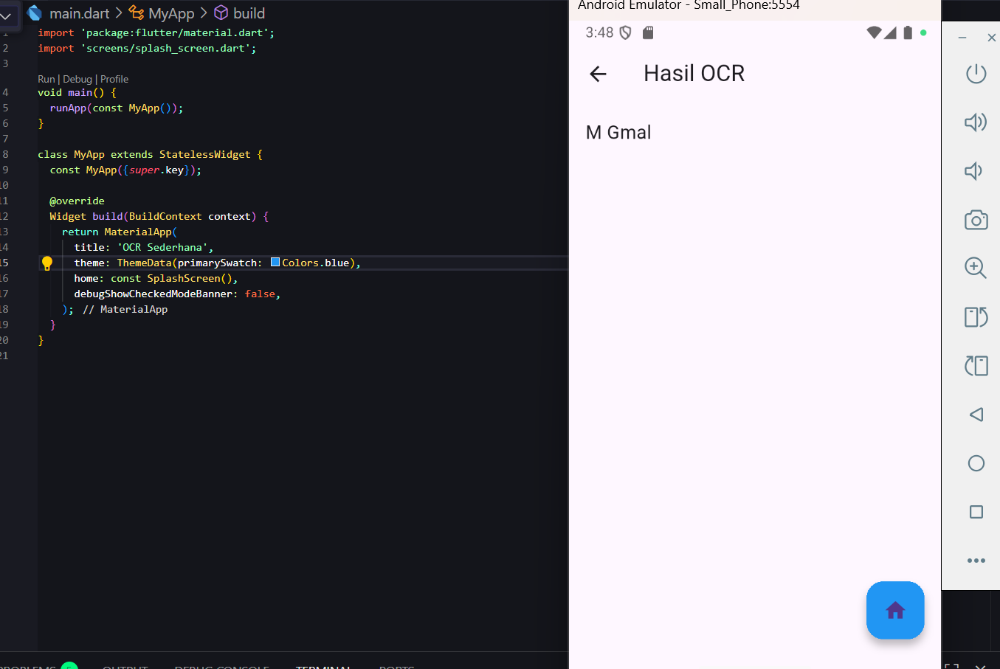
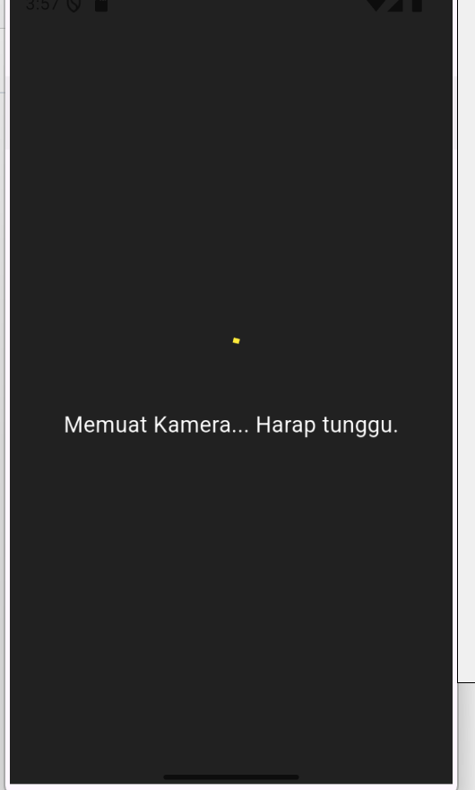
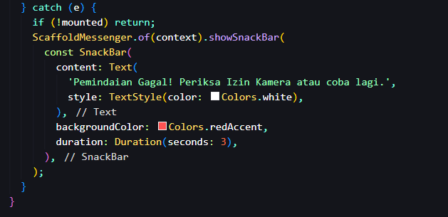
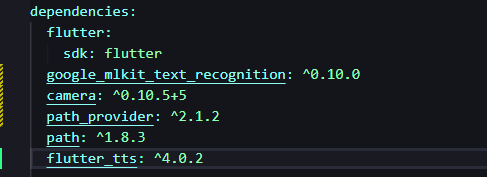
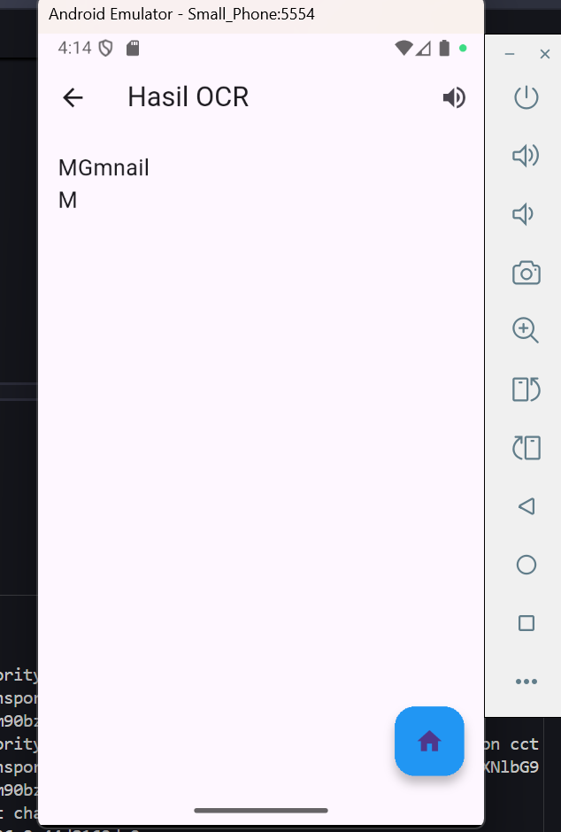

# Soal 1: Modifikasi Struktur Navigasi dan Aliran (30Poin)

Sebelumnya, tombol di halaman utama (HomeScreen) berbentuk tombol biasa (ElevatedButton).
Sekarang diubah menjadi ListTile agar tampilannya lebih elegan

Pada halaman hasil OCR (ResultScreen), fungsi replaceAll('\n', ' ') dihapus agar teks hasil pemindaian ditampilkan sesuai format aslinya, termasuk jeda baris.
Selain itu, ditambahkan FloatingActionButton dengan ikon home untuk mempermudah pengguna kembali ke halaman utama.
Tombol ini menggunakan metode Navigator.pushAndRemoveUntil() agar seluruh riwayat halaman sebelumnya dihapus dari navigation stack, sehingga aplikasi langsung kembali ke HomeScreen tanpa menekan tombol back berkali-kali.

# Soal 2: Penyesuaian Tampilan dan Penanganan State/Error(40 Poin)

Custom Loading Screen
Tampilan loading diubah agar lebih informatif bagi pengguna.
Sebelumnya, hanya menampilkan indikator tanpa teks.
Kini, latar belakang diatur menjadi warna abu gelap (Colors.grey[900]) dengan indikator kuning (Colors.yellow) dan teks "Memuat Kamera... Harap tunggu.".
Perubahan ini membantu pengguna memahami bahwa aplikasi sedang menyiapkan kamera, bukan mengalami gangguan
Penyesuaian Pesan Error
Blok catch (e) di fungsi _takePicture() dimodifikasi agar pesan kesalahan ditampilkan lebih ramah dan tidak menampilkan detail teknis.
Pesan baru pada SnackBar berbunyi:

“Pemindaian Gagal! Periksa Izin Kamera atau coba lagi.”
Langkah ini membuat aplikasi lebih profesional, karena pengguna mendapatkan pesan yang mudah dimengerti tanpa melihat kode error internal.

# Soal 3: Implementasi Plugin Text-to-Speech (TTS) (30Poin)

Buka pubspec.yaml lalu taambahkan dependency dan jalankan perintah fluttter pubget

Mengubah StatelessWidget → StatefulWidget
Inisialisasi FlutterTts di initState()
Mengatur bahasa menjadi bahasa indonesia 
dispose() memanggil tts.stop() agar tidak ada suara nyangkut saat keluar halaman
ombol IconButton dengan ikon volume_up ditambahkan pada AppBar.
Saat ditekan, fungsi _speak() dipanggil untuk membacakan teks hasil OCR menggunakan suara

